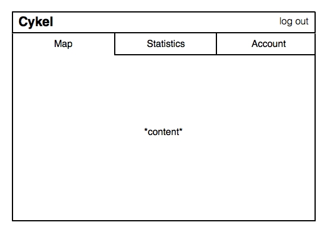

#Cykel

##The problem: 
These days, there are many attempts to try and convince people to lead healthier and more environmentally friendly lifestyles. But without proper personal motivation, very few people actually tend to adopt these habits.

##The solution: 
Provide a personal experience and visual evidence to help motivate people to change their daily routine; specifically, by way of biking. Cykel will first show users reasonable routes for biking to work, as well as how long it will take compared to driving and how many calories they'll burn. Afterward, Cykel will help users track their times to get to work and how much exercise they've gotten through a simple interface: by texting a number when they leave for work and when they arrive. The website will automatically use this data to create statistics for users to monitor their progress.

##Features:
- Interface with Google Maps API to provide safe and efficient directions for biking to work
- Calculate calories burned per trip
- Usage of texting when departing and arriving to easily collect data
- Monitor statistics and provide intuitive visual interfaces for users to monitor their progress

##"Pick Five" Items:
1. Geolocation
2. Front-end framework including Bootstrap
3. Reporting with charts and graphs
4. Send SMSes (e.g., Twilio)
5. Client-side data persistence with either local storage or web SQL

##Data to be Collected:
- Time per bike trip
- Location of workplaces and homes
- User information (age, sex, etc.)
- Caloric burnage

##Algorithms or Special Techniques:
- Calculation to translate distance to calories, based on timing and age and sex, etc.

##Mockup:

# Comments by Ming:
* Good.  Not terribly original but motivation is a hard problem.
